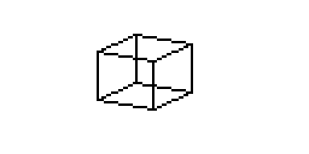
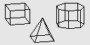

# casio_3D_renderer 
a Casio Add-In that renders a 3D objects which can be rotated

## Installation

Connect Casio fx-9860 GIII or GII to your Computer with the help of the USB cable. 
Press [F1] 
 
Open the file manager of your operating system and insert the 3DCUBE.G1A file into  
the shown device (usually D:). 
 
Eject device (usually D:). More info on calculator display. 
 
Press [EXE] as shown on the screen. 
Press [EXIT] as shown on the screen. 
Press [MENU] as shown on the screen. 
 

## Use

Open 3DCUBE by scrolling to the symbol and pressing [EXE]. 
Use arrow keys left and right to turn the cube. 
[<-] turn objects clockwise 
[->] turn objects counterclockwise 

